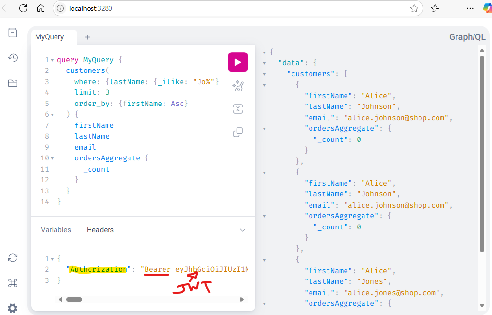

# Synopsys
Project for running an example Haura project both fully locally and in a hybrid mode with the Hasura Cloud Console with all services running on your local workstation. In the future, it will also feature how you can take Hasura 2.0 compliant YAML and convert that to Hasura DDN (or vice-versa) compliant YAML for any one-to-one feature matches.

# running the local project
- for the first time you run the project, or if you change anything (database or Hasura metadata) please run the `.\start.ps1`, if you want to stop all the containers, but keep the volumes intact run the `.\stop.ps1`. To wipe everything out and start from scratch, run the `.\scorched-earth.ps1` command, if you want to re-run it all after doing that, you'll need to run the `.\start.ps1` command again. If you want to also use Hasura 2.0, run the `.\hasura20\load-metadata.ps1` command after running `.\start.ps1` for the first time from a separate console.
- you have two options to view your GraphiQL UI
  - [Local Host](http://localhost:3280/) - run 100% from your local host, you will be able to explore, write, and run GraphQL queries
  - [Using the Hasura "Local" Web Console](https://console.hasura.io/local/graphql) - this will launch you into the Hasura website and give you the same functionality as the "Local Host" with some additional functionality, you will need to Authenticate to use this feature, please use a GMAIL account to authenticate. If you want to edit Hasura Metadata in a UI versus using the YAML only approach (add new permissions, database objects, connections, etc.) I have included a [Hasura 2.0](http://localhost:8080) engine to do this editing in a graphical format. There are instructions in this document further down on how to take the metadata generated and convert that over to Hasura DDN compliant YAML. **NOTE**: when running locally in Docker, the only way to troubleshoot your logs is from this connection using the "Insights" feature, local logs are fed to an Open Telemetry Collector and fed to a cloud endpoint using your PAT token.
 - To access a SQL Editor for Postgres, you can click on the [PG Admin](http://localhost:8889/browser/) link.

# JWT Authentication to Hasura
Hasura is authenticated to using JSON Web Tokens (JWT), in this project is a minimal OAuth IDP that supports a client credential flow for obtaining JWTs to authenticate and be authorized to the Hasura Graph. The script `.\get-jwt.ps1` can retrieve a JWT for two different clients (hasura-admin and user-john-doe). To expand to add more users or claims, you can modify the `.\idp\clients.json` file and then run `.\scorched-earth.ps1` to rebuild the container image from scratch.
- Token Endpoint - http://localhost:3000/token
- Well Known Config - http://localhost:3000/.well-known/openid-configuration
- JWK - http://localhost:3000/.well-known/jwks.json

To use the JWT in your GraphQL Query from the [local GraphiQL UI](http://localhost:3280/), paste it in the "Headers" tab like the image below using the format "Authorization": "Bearer |jwt from clipboard|":



# Hasura DDN Helper Scripts
It sometimes takes ALOT of DDN commands to execute on task, we've created some wrapper PowerShell scripts to assist with those items and to cut down on developer time / knowledge
- `.\ddn-add-connector.ps1` - wraps the 7 DDN commands used to add a new connector, apply that connector, and update your running Hasura DDN instance with that data. Running the command will kick off DDN in such a way that it will ask you what connector you want to add and then ask for the values needed to set that connector up. It will update your .env and any Hasura DDN metadata files.<br>**NOTE**: Names must start with a letter, followed by any letters, digits, or underscores.
<br>**NOTE**: When adding REST or GraphQL APIs, unlike Hasura 2.0 and Docker, the API URL you would use is not the internal name of the URL in Docker Compose, http://containername:4000/graphql for example, but instead MUST be accessible from your console, in my example the GraphQL API was resident at http://localhost:4000/graphql and I had to use that instead. If you don't do this your DDN file will fail to build. Post creation of the connector, you must change the `.env`, and run the `./start.ps1` again. You must do this each time you modify your custom GraphQL API endpoint to pick up those changes.
- `\ddn-rebuild.ps1` - if you make an HML change and then want to see it immediately applied, run this command to rebuild your Super Graph and re-deploy those changes in Docker.
<br>

# Sample GraphQL Queries
Just as a note, there are very ***slight*** differences between Hasura 2.0 and DDN GraphQL queries, the queries below return the same results but have a slightly different syntax.
- Sample Hasura DDN Query
```gql
query CustomersDDNQuery {
  customers(
    where: {lastName: {_ilike: "Jo%"}}
    limit: 35
    order_by: {firstName: Asc}
  ) {
    firstName
    lastName
    email
    ordersAggregate {
      _count
    }
  }
}
```
- Sample 2.0 Query (Hasura 2.0)
```gql
query Customers20Query {
  # 2.0 has a slighlty different syntatax for the order by statement
  customers(where: {lastName: {_ilike: "Jo%"}}, limit: 35, orderBy: {firstName: ASC}) {
    firstName
    lastName
    email
    ordersAggregate {
      # 2.0 has a slightly different syntax for aggregate queries
      aggregate {
        count
      }
    }
  }
}
```
- Sample Query 3 (Hasura DDN & 2.0 compliant GraphQL query against a Remote Schema)
```gql
query StatesQuery {
  states
}
```
# using Hasura 2.0 to develop for Hasura DDN
While Hasura 2.0 has a robust UI for development (adding connectors, database objects, authorization, actions, remote schemas, etc.); Hasura DDN **ONLY** has an option for using YAML files to do the same type of work. Due to that, this project loads both Hasura 2.0 AND Hasura DDN and allows you to develop in 2.0 for DDN by exporting the 2.0 YAML files and converting them to DDN compliant YAML files. The following scripts are used to make this happen leveraging the Hasura 2.0 CLI:
- `.\hasura20\load-metadata.ps1` - script will load 2.0 metadata contained in the `./hasura20/metadata` directory into the Hasura 2.0 instance running locally at http://localhost:8080, if you are running the project for the first time and want to load the Hasura 2.0 instance with metadata, run this command ***AFTER*** running `.\start.ps1`
- `.\hasura20\export-metadata.ps1` - script exports the current 2.0 metadata into a YAML files structure found under ./hasura20/metadata
- `.\hasura20\convert20-to-ddn.ps1` - script will take the 2.0 metadata and convert it to Hasura DDN metadata where the feature parity is a one-to-one match; ***THIS IS A Work-in-progress currently***
- `.\hasura20\convertddn-to-20.ps1` - script will take the ddn metadata and convert it to Hasura 2.0 metadata where the feature parity is a one-to-one match; ***THIS IS A Work-in-progress currently***

# Training and Informational Links
- [Local Development Examples with different DBs](https://github.com/hasura/ddn-examples/blob/main/README.md)
- [DDN CLI Installation](https://hasura.io/docs/3.0/reference/cli/installation/) - **REQUIRED** for Hasura DDV Development
- [Hasura DDN VS Code Plugin](https://marketplace.visualstudio.com/items?itemName=HasuraHQ.hasura)
- [Connect DDN to Elasticsearch](https://hasura.io/docs/3.0/how-to-build-with-ddn/with-elasticsearch/)
- [Setting up JWTs for OAuth in Hasura DDN](https://github.com/hasura/ddn-docs/blob/main/docs/auth/jwt/jwt-configuration.mdx)

# Video Links
- [Setup Hasura DDN in under 1 minute speed run](https://www.youtube.com/watch?v=OsO6TzwFb30)
- [Hasura DDN Developer Experience (DX)](https://www.youtube.com/watch?v=PKt1WMPjq5w)
- [Local Development plus API Refinement](https://www.youtube.com/watch?v=WuyOhGThm8c)
- [Create Hasura generated REST APIs](https://www.youtube.com/watch?v=Iuxhjo7Ko9c)
= [GraphQL Federation (v2 Remote Schemas) as a connector in DDN](https://www.youtube.com/watch?v=LJBTBIOB44U)
- [Metadata Upgrade from Hasura 2.0 to DDN](https://hasura.io/docs/3.0/upgrade/overview/)