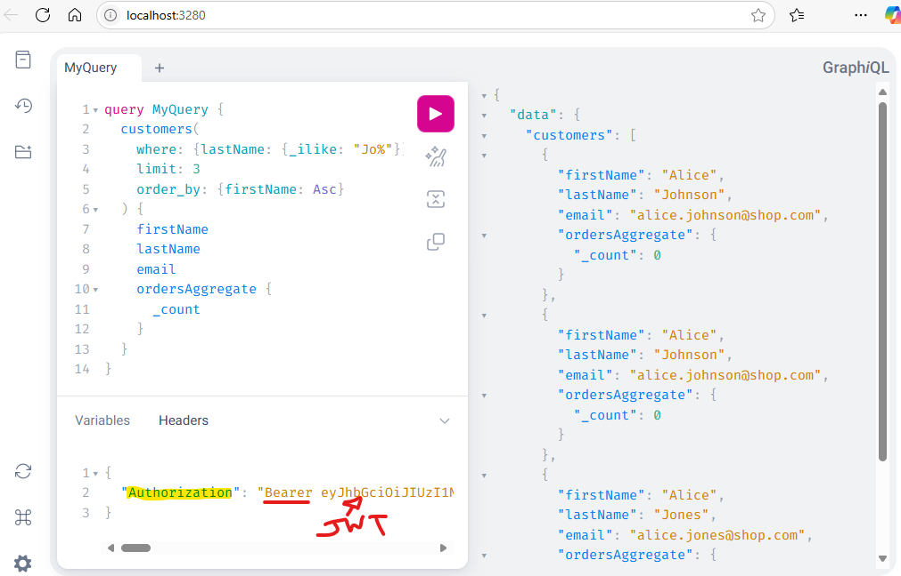

# Overview
Example project for running a Hasura GraphQL engine with all services running on your local workstation in Docker to compare running Hasura DDN against running Hasura 2.0. Both GraphQL engines will be running at the same time on the same database to showcase the differences.

# Running the local project
For the first time you run the project please run the `.\start.ps1`. If you want to stop all the containers, but keep the volumes intact run the `.\stop.ps1`. To wipe everything out and start from scratch, run the `.\scorched-earth.ps1` command, if you want to re-run it all after doing that, you'll need to run the `.\start.ps1` command again. 

# Hasura DDN
Hasura DDN is the latest version of the Hasura engine.
- You have two options to view your GraphiQL UI
  - [Local Host](http://localhost:3280/) - run 100% from your local host, you will be able to explore, write, and run GraphQL queries
  - [Using the Hasura "Local" Web Console](https://console.hasura.io/local/graphql) - this will launch you into the Hasura website and give you GraphiQL UI plus a few extra features. If you want to edit Hasura Metadata in a UI versus using the YAML only approach (add new permissions, database objects, connections, etc.) I have included a [Hasura 2.0](http://localhost:8080) engine, this has helped me model changes before applying them in Hasura DDN, password for Hasura 2.0’s Console is `123456`.
- To access a SQL Editor for Postgres, you can click on the [PG Admin](http://localhost:8889/browser/) link. To login into PG Admin, the user is `user@user.com`, and the password is `test123`. When you login the database connection is already setup, and the password is `postgres`.
**NOTE**: When running either GraphIQl UI, you will need to use a JWT to authenticate for Hasura DDN, this is added as an "Authorization" header, and details of of how to get a JWT are in the next section.

# JWT Authentication to Hasura
Hasura is authenticated to using JSON Web Tokens (JWT), in this project is a minimal OAuth IDP that supports a client credential flow for obtaining JWTs to authenticate and be authorized to the Hasura Graph. The script `.\get-jwt.ps1` can retrieve a JWT for two different clients (hasura-admin and user-john-doe). To expand to add more users or claims, you can modify the `.\idp\clients.json` file and then run `.\scorched-earth.ps1` and `start.ps1` to rebuild the container image from scratch. JWTs are timebound and expire in an hour, so you may need to get a new JWT if it expires while you are testing.
- Token Endpoint - http://localhost:3000/token
- Well Known Config - http://localhost:3000/.well-known/openid-configuration
- JWK - http://localhost:3000/.well-known/jwks.json
To use the JWT in your GraphQL Query from the [local GraphiQL UI](http://localhost:3280/), paste it in the "Headers" tab like the image below using the format "Authorization": "Bearer |jwt from clipboard|":



**NOTE**: The IDP used here is ***only*** for local development, as it uses the HS256 algorithm and a shared secret, instead of private secret to sign the JWT, and a public secret to validate it. This is fine when working in a local environment, but it should never be used as a production Identity Provider.

# Hasura 2.0 running in parallel with Hasura DDN
This project also loads Hasura 2.0 so you can view and compare the two products together (especially handy if you are moving from Hasura 2.0 to DDN). While Hasura 2.0 is up and running, you need to, at a minimum, run the script `.\hasura20\load-metadata.ps1` so all the correct metadata will be available when you access it. To access it you need to go to http://localhost:8080 and the admin password locally is `123456`. Hasura 2.0 is also using JWT authentication leveraging the local IDP, so if you are not running as an admin you will need an Authorization header and a Bearer token (you can get a token by running the script `.\get-jwt.ps1`)
- `.\hasura20\load-metadata.ps1` - script will load 2.0 metadata contained in the `./hasura20/metadata` directory into the Hasura 2.0 instance running locally at http://localhost:8080, if you are running the project for the first time and want to load the Hasura 2.0 instance with metadata, run this command ***AFTER*** running `.\start.ps1`
- `.\hasura20\export-metadata.ps1` - script exports the current 2.0 metadata into a YAML files structure found under ./hasura20/metadata
<!-- - `.\hasura20\convert20-to-ddn.ps1` - script will take the 2.0 metadata and convert it to Hasura DDN metadata where the feature parity is a one-to-one match; ***THIS IS A Work-in-progress currently***
- `.\hasura20\convertddn-to-20.ps1` - script will take the ddn metadata and convert it to Hasura 2.0 metadata where the feature parity is a one-to-one match; ***THIS IS A Work-in-progress currently*** -->

# Logs
Hasura DDN logs to an Open Telemetry API endpoint. To accommodate this, I’ve written a custom OTEL API that will take the logs and store them in the `otel` schema in the Postgres DB running in Docker. If you are running your Hasura DDN GraphiQL instance as Admin, you can pull the logs using a GraphQL query like what is below:
```gql
# query last 10 graphql queries in Hasura DDN
query MyQuery {
  otelTraces(
    where: {name: {_eq: "execute_query"}}
    limit: 10
    order_by: {createdAt: Desc}
  ) {
    createdAt
    name
    attributes
  }
}
# same query in Hasura 2.0
query MyQuery {
  otelTraces(orderBy: {createdAt: DESC}, limit: 10, where: {name: {_eq: "execute_query"}}) {
    createdAt
    name
    attributes
  }
}
```
Alternately, you can query the DB via [PG Admin](http://localhost:8889/browser/), here are some sample queries:
```sql
-- last 10 queries
select created_at, traces.attributes from otel.traces 
where traces.attributes @> '{"operation_name": "MyQuery"}'
  and name = 'execute_query'
order by created_at desc
limit 10;
-- counts of all the different types of logs captures
select count(*), name 
from otel.traces 
group by name 
order by name;
-- find a specific GraphQL query by name
SELECT *
FROM otel.traces 
WHERE attributes ->> 'display.name' = 'Execute CustomersDDNQuery';
```
# Hasura DDN Helper Scripts
It sometimes takes ALOT of DDN commands to execute a task, we've created some wrapper PowerShell scripts to assist with those items and to cut down on developer time / knowledge
- `.\ddn-add-connector.ps1` - wraps the 7 DDN commands used to add a new connector, apply that connector, and update your running Hasura DDN instance with that data. Running the command will kick off DDN in such a way that it will ask you what connector you want to add and then ask for the values needed to set that connector up. It will update your .env and any Hasura DDN metadata files.
<i><br>**NOTE**: Names must start with a letter, followed by any letters, digits, or underscores.
<br>**NOTE**: When adding REST or GraphQL APIs, unlike Hasura 2.0 and Docker, the API URL you would use is not the internal name of the URL in Docker Compose, http://containername:4000/graphql for example, but instead MUST be accessible from your console, in my example the GraphQL API was resident at http://localhost:4000/graphql and I had to use that instead. If you don't do this your DDN file will fail to build. Post creation of the connector, you must change the `.env`, and run the `./start.ps1` again. You must do this each time you modify your custom GraphQL API endpoint to pick up those changes.
- `\ddn-rebuild.ps1` - if you make an HML change and then want to see it immediately applied, run this command to rebuild your Super Graph and re-deploy those changes in Docker.
<br></i>


- `ddn-add-models-all.ps1` - this script will generate and add any database tables or views added to the local Postgres DB to the DDN HML, including relationships if they exist in the database.

# Sample GraphQL Queries
Just as a note, there are very ***slight*** differences between Hasura 2.0 and DDN GraphQL queries, the queries below return the same results but have a slightly different syntax.
- Sample Hasura DDN Query
```gql
query CustomersDDNQuery {
  customers(
    where: {lastName: {_ilike: "Jo%"}}
    limit: 35
    order_by: {firstName: Asc}
  ) {
    firstName
    lastName
    email
    ordersAggregate {
      _count
    }
  }
}
```
- Sample 2.0 Query (Hasura 2.0)
```gql
query Customers20Query {
  # 2.0 has a slighlty different syntatax for the order by statement
  customers(where: {lastName: {_ilike: "Jo%"}}, limit: 35, orderBy: {firstName: ASC}) {
    firstName
    lastName
    email
    ordersAggregate {
      # 2.0 has a slightly different syntax for aggregate queries
      aggregate {
        count
      }
    }
  }
}
```
- Sample Query 3 (Hasura DDN & 2.0 compliant GraphQL query against a Remote Schema)
```gql
query StatesQuery {
  states
}
```

# Observing Authorization
If you are logging in as a Hasura Admin role, you have unfettered access to the whole Graph. I've created a second role called `user` which limits what can be viewed in the Graph and has row level filtering placed on it (that's stored in the Postgres table `security.user_to_customer`). You can obtain a JWT using the `user-john-doe` option when running `.\get-jwt.ps1`. You must also set the Header for `x-hasura-role` to `user` so Hasura knows what security context you are in. Try the queries below, first as an Admin, then as the `john-doe` User and you will see the queries return different counts:
``` gql
# for an Admin the count will be 100, for the user-john-doe User the count will be 10
query QueryHasuraDDNCustomerCount {
  customersAggregate {
    _count
  }
}
# same query in Hasura 2.0
query QueryHasura20CustomerCount {
  customersAggregate {
    aggregate {
      count
    }
  }
}
```
<!--

# Running in Kubernetes
Still a WIP, but I'm building out a set of scripts to run on Docker Desktop's local Kubernetes instance.  To run that script please execute the file `start-k8ts.ps1`, to destroy everything you have running in Kubernetes for this project, run the command `scorched-earth-k8ts.ps1`. Currently only part of the "datasource" comes up and is inaccessible locally at the moment (still a work-in-progress).
-->


# Training and Informational Links
- [Local Development Examples with different DBs](https://github.com/hasura/ddn-examples/blob/main/README.md)
- [DDN CLI Installation](https://hasura.io/docs/3.0/reference/cli/installation/) - **REQUIRED** for Hasura DDV Development
- [Hasura DDN VS Code Plugin](https://marketplace.visualstudio.com/items?itemName=HasuraHQ.hasura)
- [Connect DDN to Elasticsearch](https://hasura.io/docs/3.0/how-to-build-with-ddn/with-elasticsearch/)
- [Setting up JWTs for OAuth in Hasura DDN](https://github.com/hasura/ddn-docs/blob/main/docs/auth/jwt/jwt-configuration.mdx)

# Video Links
- [Setup Hasura DDN in under 1 minute speed run](https://www.youtube.com/watch?v=OsO6TzwFb30)
- [Hasura DDN Developer Experience (DX)](https://www.youtube.com/watch?v=PKt1WMPjq5w)
- [Local Development plus API Refinement](https://www.youtube.com/watch?v=WuyOhGThm8c)
- [Create Hasura generated REST APIs](https://www.youtube.com/watch?v=Iuxhjo7Ko9c)
= [GraphQL Federation (v2 Remote Schemas) as a connector in DDN](https://www.youtube.com/watch?v=LJBTBIOB44U)
- [Metadata Upgrade from Hasura 2.0 to DDN](https://hasura.io/docs/3.0/upgrade/overview/)
